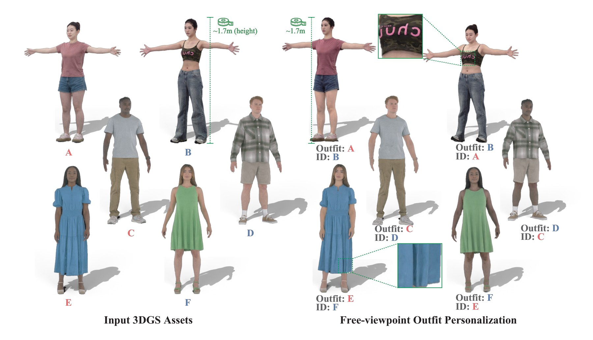
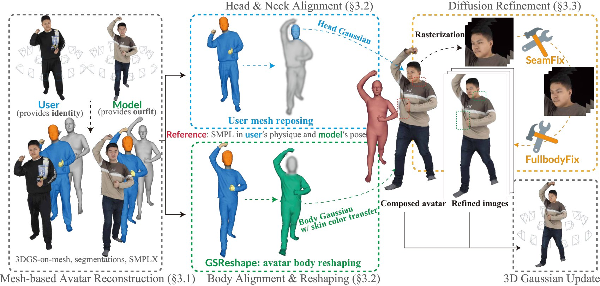
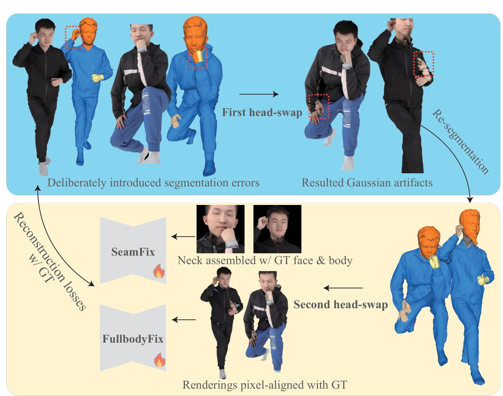

<div align="center">

# AvatarMix

### Identity-Preserving Cross-Avatar Composition for Outfit Personalization

[Zhaorong Wang](https://larsph.github.io/) · [Yoshihiro Kanamori](https://kanamori.cs.tsukuba.ac.jp/) · [Yuki Endo](https://endo-yuki-t.github.io/)

University of Tsukuba · **CVPR 2026 Findings**

[Paper](https://arxiv.org/abs/2606.03506) · [Project Page](https://larsph.github.io/avatarmix/) · [Video](https://larsph.github.io/avatarmix/static/videos/AvatarMix_CVPR2026F_video.mp4)

</div>



AvatarMix combines a user's identity with another avatar's outfit in a mesh-based 3D Gaussian representation. GSReshape adapts the clothed body to the user's physique; SeamFix repairs the head–neck join, and optional FullbodyFix restores appearance after reshaping.

## Method



The workflow reconstructs mesh-based Gaussian avatars, composes the user's head with the model's reshaped body, refines rendered views, and updates the composed Gaussians. See the [paper](https://arxiv.org/abs/2606.03506) for the method and implementation details.

## Installation

Use Linux, an NVIDIA GPU, and separate environments for the pipeline components. The code uses `uv`; CUDA extensions require a compatible CUDA toolkit and C++ compiler.

Follow [Installation](docs/installation.md), then [Data preparation](docs/data_preparation.md). Commands below run from the repository root unless stated otherwise. Set the data directory once in your shell, or use the default `data/` directory:

```sh
export AVATARMIX_DATA_ROOT=/absolute/path/to/data
```

For fish, use `set -gx AVATARMIX_DATA_ROOT /absolute/path/to/data` instead.

## Usage

Inspect the pipeline options:

```sh
uv run --project swapvton python swapvton/src/scripts/pipeline.py --help
```

After preparing two avatars and editing the input/output settings in [thuman2.yaml](swapvton/src/configs/thuman2.yaml), compose a user–model pair:

```sh
uv run --project swapvton python swapvton/src/scripts/pipeline.py \
  --config swapvton/src/configs/thuman2.yaml --subjects 0365,0228 \
  --run-stages head_donator_reposing,cloth_fit_reshaping,direct_swapping,render_swapped_gaussians
```

Subject IDs are examples: use subjects available in your own dataset. The pair configuration controls direction, shape fitting, camera selection, and intermediate output paths.

With a trained SeamFix checkpoint placed at `external_assets/seamfix.ckpt`, refine the views and update the avatar (pretrained AvatarMix checkpoints are coming soon):

```sh
uv run --project swapvton python swapvton/src/scripts/pipeline.py \
  --config swapvton/src/configs/thuman2.yaml --subjects 0365,0228 \
  --run-stages difix_refinement,splatting_avatar_gs_finetune
```

FullbodyFix is optional and is selected by visual inspection of reshaping artifacts. Use [thuman2_fullbody.yaml](swapvton/src/configs/thuman2_fullbody.yaml) with `external_assets/fullbodyfix.ckpt` for full-body refinement. The data guide explains the intermediate artifacts these stages consume.

## Training



See [Training](docs/training.md) for double-swap data generation, pair manifests, and refiner training commands. The refiner configurations are [seamfix.yaml](difix/configs/experiment/seamfix.yaml) and [fullbodyfix.yaml](difix/configs/experiment/fullbodyfix.yaml).

## Code layout

| Directory | Role |
| --- | --- |
| `swapvton/` | Pipeline, preprocessing, cross-avatar composition, and training-data generation |
| `splatting/` | Mesh-based Gaussian reconstruction, deformation, rendering, and fine-tuning |
| `cloth-fit/` | Mesh retargeting used by GSReshape |
| `difix/` | SeamFix and FullbodyFix training and inference |
| `neus2/` | Initial surface reconstruction |
| `4d-dress/`, `sam3/` | Semantic parsing and hand segmentation |
| `lbs_transfer/` | Skinning-weight transfer |

## Release TODO

- [ ] Pretrained SeamFix and FullbodyFix checkpoints
- [ ] Example assets

## Citation

```bibtex
@inproceedings{wang2026avatarmix,
  author    = {Wang, Zhaorong and Kanamori, Yoshihiro and Endo, Yuki},
  title     = {{AvatarMix}: Identity-Preserving Cross-Avatar Composition for Outfit Personalization},
  booktitle = {Proceedings of the IEEE/CVF Conference on Computer Vision and Pattern Recognition (CVPR) Findings},
  month     = {June},
  year      = {2026},
  pages     = {425-435}
}
```

## Acknowledgements and license

AvatarMix builds on SplattingAvatar, Gaussian Splatting, Difix3D+, NeuS2, 4D-DRESS, SAM/SAM3, Intersection-Free Garment Retargeting, and Robust Skin Weights Transfer. We thank their authors for sharing their work.

AvatarMix's original code is provided for **non-commercial research** under [LICENSE](LICENSE). Third-party code and modifications derived from it remain subject to their respective terms; see [Third-party notices](THIRD_PARTY_NOTICES.md). Model weights, body models, and datasets have separate licenses and are not bundled here.

For questions, contact [Zhaorong Wang](mailto:zhaorong.wang1997@gmail.com).
